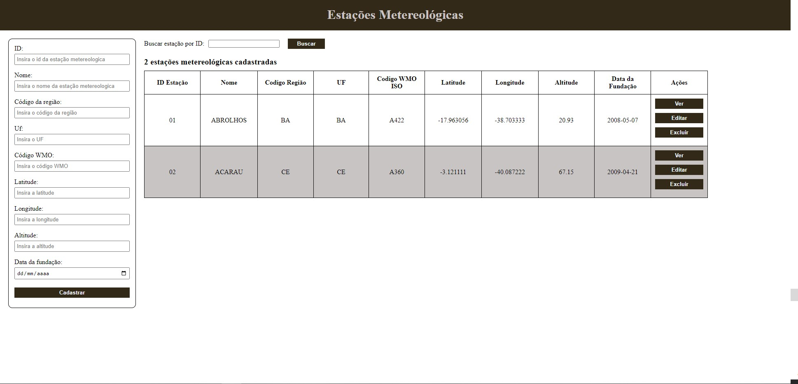

# Sistema Baseados em Sensores

# Sobre o Projeto

Os Sistemas Baseados em Sensores, são sistemas cujo principal objetivo é coletar dados a partir de um conjunto de sensores e processá-los de alguma forma. 

O projeto consiste na criação de uma API REST para gerenciar as estações metereológicas brasileiras que coletam dados através dos sensores, para o Banco de Dados Meteorológicos do INMET.

## API REST
Os endpoints da API REST, assim como as principais caracteristicas, estão apresentados na tabela abaixo:
| HTTP | URL | Descrição |
|---|---|---|
| GET | /api/v1/estacoes | Obter todas as estações. |
| GET | /api/v1/estacoes/{id} | Obter uma estação por ID|
| POST | /api/v1/estacoes | Adicionar uma nova estação. |
| POST | /api/v1/estacoes/{id} | Atualizar uma estação existente. |
| DELETE | /api/v1/estacoes/{id} | Excluir uma estação. |

## Dicionário de Dados
A próxima tabela é referente a um dicionário de dados, onde está apresentado as definições e representaçõe dos itens de dados que serão processados pela aplicação.
As informações de metadados apresentados neste dicionário de dados incluem o nome do campo, o tipo de dados, se o campo pode estar vazio ou não, ou seja, se ele é obrigatório ou não, os valores máximo e mínimo aceitos, o valor padrão inicial daquele determinado campo, bem como, informações adicionais na coluna observação.

| Campo | Tipo | Descrição |
|---|---|---|
| id_estacao | Inteiro | Chave primária que identifica de maneira única cada estação metereológica. |
| nome_estacao | Texto | Nome da estação metereológica. |
| cod_regiao | Texto | Um ou dois caracteres representando a região brasileira onde está localizada a estação, por exemplo: Norte (N), Nordeste (NE), Sudeste (SE), Sul (S), Centro Oeste (CO). |
| uf | Texto | Código Unidade Federativa (UF) do estado |
| codigo_wmo | Texto | Código WMO da estação meteorológica, por exemplo: A001 |
| latitude | Real | Um número real representando a latitude. |
| longitude | Real| Um número real representando a longitude. |
| altitude | Real | Um número real representando a altitude. |
| data_fundacao | Data | Data de fundação da estação meteorológica no formato YYYY-MM-DD, por exemplo: 2000-05-07. |

## Tecnologias

A API REST foi criada utilizando a linguagem de programação Python e o framework Flask para dar suporte ao padrão MVC.

# Índice/Sumário

* [Sobre](#sobre-o-projeto)
* [Sumário](#índice/sumário)
* [Requisitos Funcionais](#requisitos-funcionais)
* [Tecnologias Usadas](#tecnologias-usadas)
* [Contribuição](#contribuição)
* [Autores](#autores)
* [Licença](#licença)
* [Agradecimentos](#agradecimentos)

# Requisitos Funcionais 

- [ ] Visualizar Aeroportos
- [ ] Cadastrar Novo Aeroporto
- [ ] Visualizar Aeroporto por IATA
- [ ] Editar Aeroporto 
- [ ] Remover Aeroporto

# Tecnologias Usadas

- 
- 
- 
- 
- 

# Contribuição

Leia o arquivo [CONTRIBUTING.md](CONTRIBUTING.md) para saber detalhes sobre o nosso código de conduta e o processo de envio de solicitações *pull* (*Pull Request*) para nós.

# Autores

<table>
  <tbody>
    <tr>
    <td align="center">
	  	<a href="https://github.com/annekarolinefc">
			
			 
			<b>Anne K. F. Carmo</b>
		</a>
		 
		<a href="https://github.com/annekarolinefc" title="Code">💻</a>
	</td>
	<td align="center">
	  	<a href="LINK-DO-GIT-AQUI">
			
			 
			<b>NOMEAQUI</b>
		</a>
		 
		<a href="LINK-DO-GIT-AQUI" title="Code">💻</a>
	</td>
	<td align="center">
	  	<a href="LINK-DO-GIT-AQUI">
			
			 
			<b>NOMEAQUI</b>
		</a>
		 
		<a href="LINK-DO-GIT-AQUI" title="Code">💻</a>
	</td>
	<td align="center">
	  	<a href="LINK-DO-GIT-AQUI">
			
			 
			<b>NOMEAQUI</b>
		</a>
		 
		<a href="LINK-DO-GIT-AQUI" title="Code">💻</a>
	</td>
	<td align="center">
	  	<a href="LINK-DO-GIT-AQUI">
			
			 
			<b>NOMEAQUI</b>
		</a>
		 
		<a href="LINK-DO-GIT-AQUI" title="Code">💻</a>
	</td>
    </tr>
	</tbody>
<table>

# Licença

Este projeto está licenciado sob a Licença MIT,  consulte o arquivo [LICENSE.md](LICENSE.md) para mais detalhes.
	

# Agradecimentos

**Seção livre para você agradecer a todos que contribuiram para a execução do seu projeto.**

json-server --watch database.json